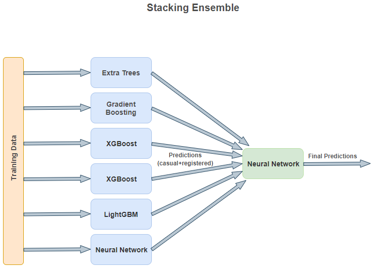

# Stacking Ensemble
A Stacking Ensemble implementation using scikit-learn, Keras, XGBoost and LightGBM for the bike sharing demand problem as part of my 9th semester Data Mining course project.

### Architecture:

.
